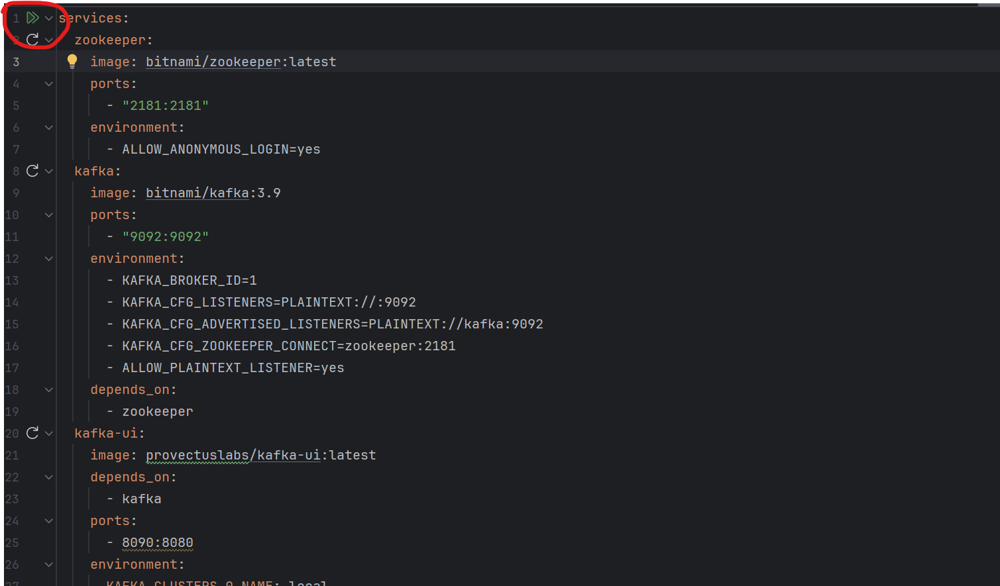
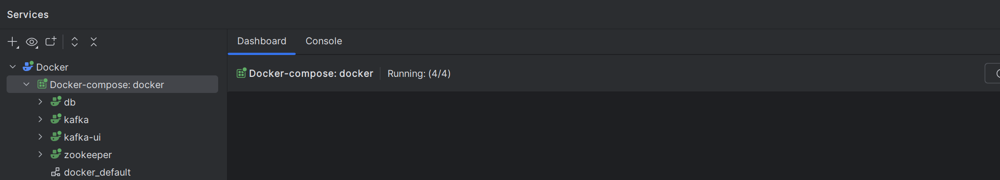
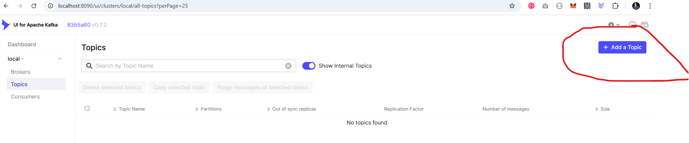
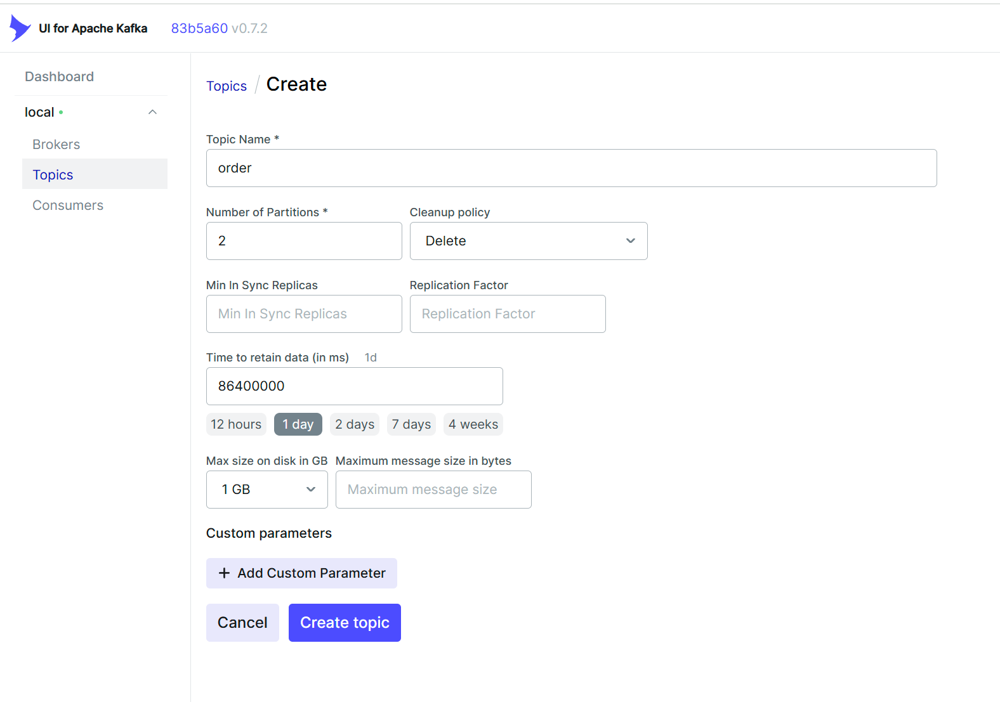

# Order System #
Simple Order System that utilize the power of Kafka for asynchronous communication between services

## Pre-requisite
- Docker engine or similar (Lima, nerdctl, etc..) should be installed in your system

## Start MySQL and Kafka
- You can click the double play button to run the MySQL and Kafka containers using docker/docker-compose.yaml 
- The containers should be colored green as in this image if they are started successfully 

## Add Kafka Topics
- Go to Kakfa UI: http://localhost:8090/ui/clusters/local/all-topics and clicked `[+ Add a Topic]` button 
- Set `order` as the topic name and populate the other details 
- Then create `shipping` topic using the same process as above.

## MySQL DB
- You can access the db using MySQL Workbench or any db explorer
- username: root, password: admin, port: 3307: schema: silverspin

## Run the App
### Running locally:
- `./gradlew build` to build the app
- `./gradlew bootRun` to run the app locally

### Containerize:
- `./gradlew bootBuildImage --imageName=order-system` to build the image
- `docker run -p 8081:8080 -t order-system` to start the app
- `docker stop <container-id>` to stop

## PHP
- Nothing here yet as I'm still learning it.
- To see the php web app, on command line run PHP's web server `php -S localhost:8080`

### Endpoints ###
* [POST] http://localhost:8081/silverspin/api/accounts - create account
* [POST] http://localhost:8081/silverspin/api/orders - create order
* [GET] http://localhost:8081/silverspin/api/orders/{orderId}/{accountId} - get order by orderId and accountId
* [GET] http://localhost:8081/silverspin/api/orders?accountId={accountId}}&page={page}&size={size}&sortBy={sortBy}&sortDir=DESC 
   - get all orders accountId
* [POST] http://localhost:8082/silverspin/api/shipping - update shipping record

### Postman Collection ###
* Pls check  [Integration Testing.postman_collection.json](misc/postman/Integration%20Testing.postman_collection.json) if you want to test using Postman
* It contains integration testing for all the end points posted above.

### Swagger Playground ###
* [order-service] http://localhost:8081/silverspin/api/swagger-ui/index.html
* [shipping-service] http://localhost:8082/silverspin/api/swagger-ui/index.html

## Room for Improvements
- At the moment Unit testing is not included
- API Security
- Use Debezium. I tried, but it is not working at the moment.
