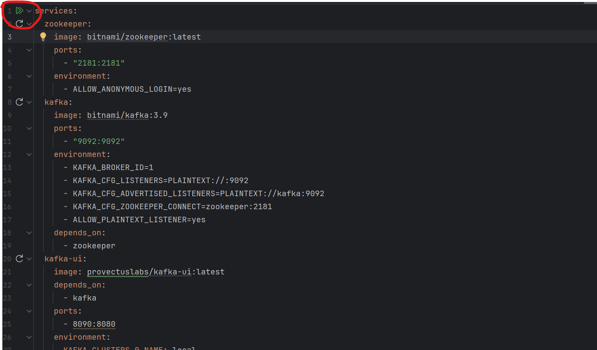
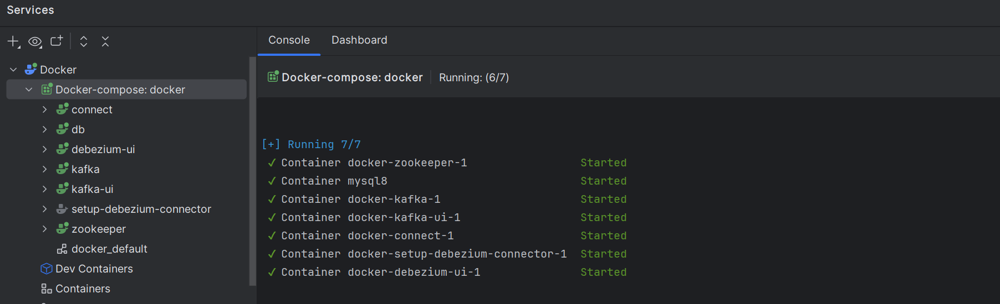
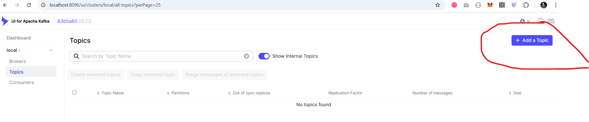
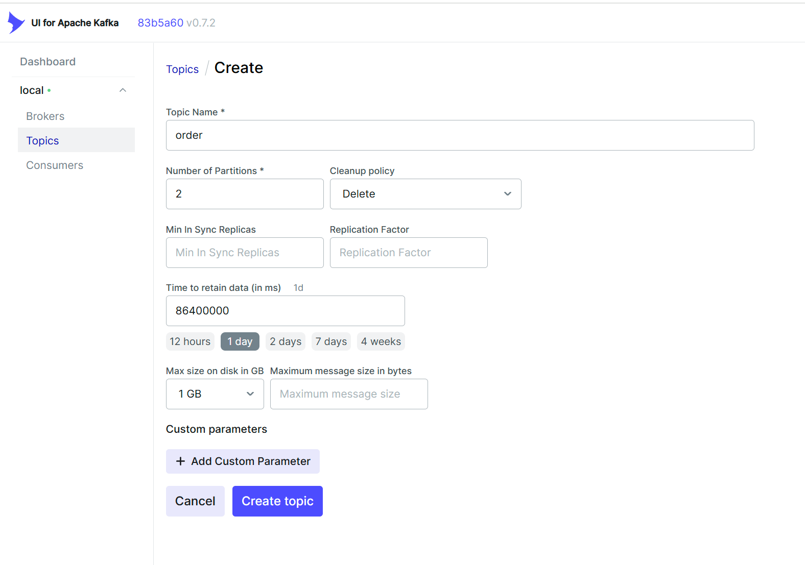

# Order System #

### Swagger Playground ###
* http://localhost:8081/silverspin/api/order/swagger-ui/index.html

## Pre-requisite
- Docker engine or similar (Lima, nerdctl, etc..) should be installed in your system
## Start MySQL and Kafka
- You can click the double play button to run the MySQL and Kafka containers using docker/docker-compose.yaml 
- The containers should be colored green as in this image if they are started successfully 

## Add a Kafka Topic
- Go to Kakfa UI: http://localhost:8090/ui/clusters/local/all-topics and clicked `[+ Add a Topic]` button 
- Set `order` as the topic name and populate the other details 

## Check Kafka and Connector
- Kakfa UI: http://localhost:8090/
- Debezium UI: http://localhost:9091/

### Add Connector
- If connector is not auto created when you run the docker-compose.yaml, you can create it manually on http://localhost:9091/
- Choose Mysql and click Next button
- 
- 

## MySQL DB
- You can access the db using MySQL Workbench or any db explorer
- username: root, password: admin, port: 3307: schema: silverspin

