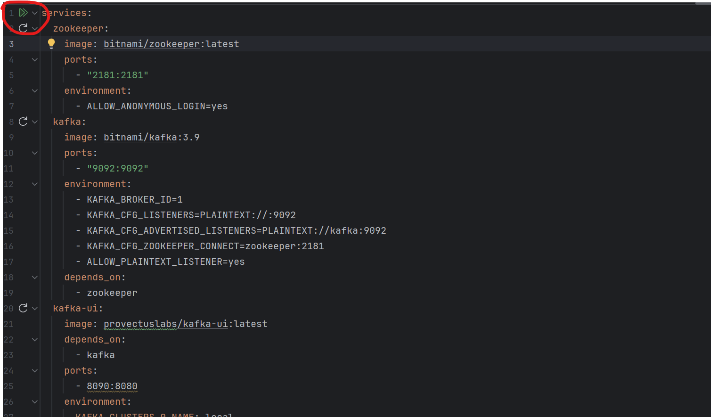
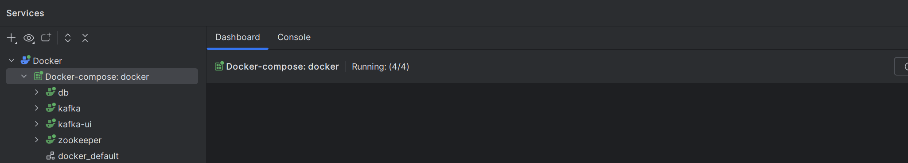
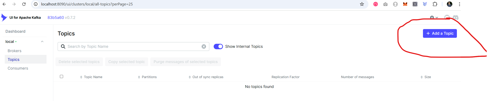
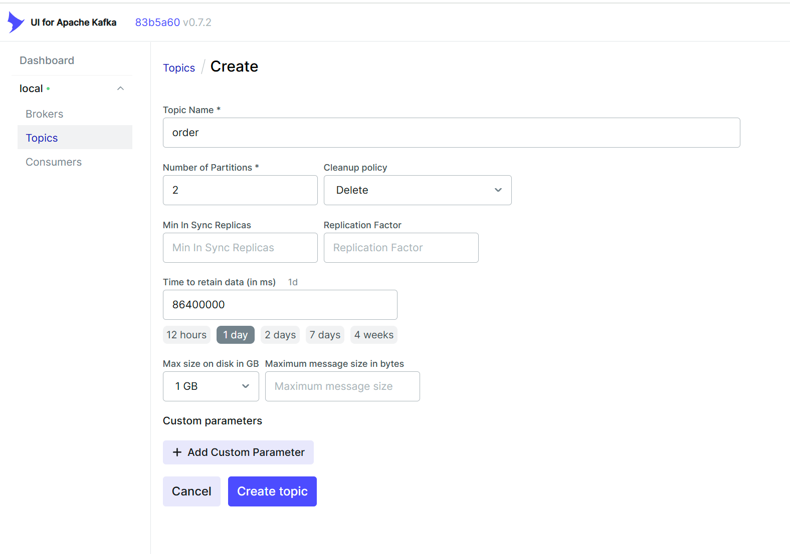
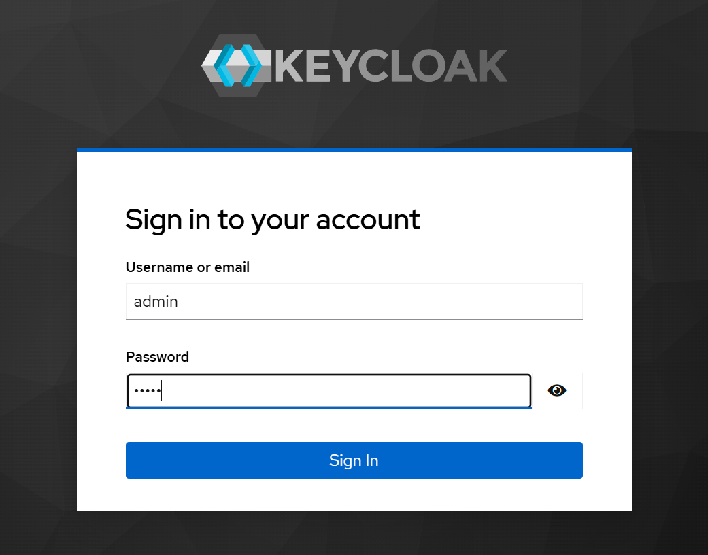
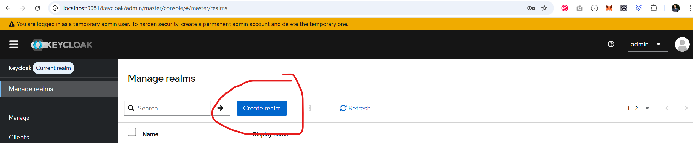
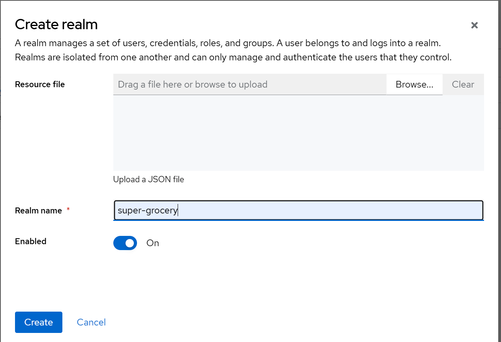
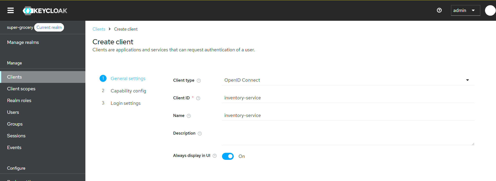

# Order System #
Simple Order System that utilize the power of Kafka for asynchronous communication between services

## Pre-requisite
- Docker engine or similar (Lima, nerdctl, etc..) should be installed in your system

## Start MySQL, Kafka, Redis and Keycloak
- You can click the double play button to run the MySQL and Kafka containers using docker/docker-compose.yaml 
- The containers should be colored green as in this image if they are started successfully 

## Add Kafka Topics
- Go to Kakfa UI: http://localhost:8090/ui/clusters/local/all-topics and clicked `[+ Add a Topic]` button 
- Set `order` as the topic name and populate the other details 
- Then create `shipping` topic using the same process as above.

## MySQL DB
- You can access the db using MySQL Workbench or any db explorer
- username: root, password: admin, port: 3307: schema: silverspin

## Redis
- Download Redis Insight https://redis.io/insight/ if you wan to have a GUI of your redis cache

## Keycloak
- Access Keycloak UI: http://localhost:9081/keycloak and login 
- Add `super-grocery` realm  
- Add client:  

## Run the App
### Running locally:
- `./gradlew build` to build the app
- `./gradlew bootRun` to run the app locally

### Containerize:
- `./gradlew bootBuildImage --imageName=order-system` to build the image
- `docker run -p 8081:8080 -t order-system` to start the app
- `docker stop <container-id>` to stop

## PHP
- Nothing here yet as I'm still learning it.
- To see the php web app, on command line run PHP's web server `php -S localhost:8080`

## Troubleshooting
- Check specific port `netstat -ano | findStr ":80"`

## Endpoints ##
* [POST] http://localhost:8081/silverspin/api/accounts - create account
* [POST] http://localhost:8081/silverspin/api/orders - create order
* [GET] http://localhost:8081/silverspin/api/orders/{orderId}/{accountId} - get order by orderId and accountId
* [GET] http://localhost:8081/silverspin/api/orders?accountId={accountId}}&page={page}&size={size}&sortBy={sortBy}&sortDir=DESC 
   - get all orders accountId
* [POST] http://localhost:8082/silverspin/api/shipping - update shipping record

## Postman Collection ##
* Pls check  [Integration Testing.postman_collection.json](misc/postman/Integration%20Testing.postman_collection.json) if you want to test using Postman
* It contains integration testing for all the end points posted above.

## Swagger Playground ##
* [order-service] http://localhost:8081/silverspin/api/swagger-ui/index.html
* [shipping-service] http://localhost:8082/silverspin/api/swagger-ui/index.html
* [inventory-service] http://localhost:8083/silverspin/api/swagger-ui/index.html

## Resource Consumption Monitoring Tool
We will use JConsole tool. To run it, open a new terminal and run:
`jconsole`

**Running applications as Docker containers**

We will use the `cAdvisor` tool. In a browser, access:
  - To explore the running containers: http://localhost:8087/docker/
  - To go directly to a specific container:
    - order-service: http://localhost:8087/docker/order-service
    - shipping-service: http://localhost:8087/docker/shipping-service
    - inventory-service: http://localhost:8087/docker/inventory-service

## Eureka Server
- Access from http://localhost:8761

## Harbor Container Registry
- Access from http://localhost/
  - credentials:`springboot/Springboot1`

## Room for Improvements
- API Security
- Use Debezium. I tried, but it is not working at the moment.
